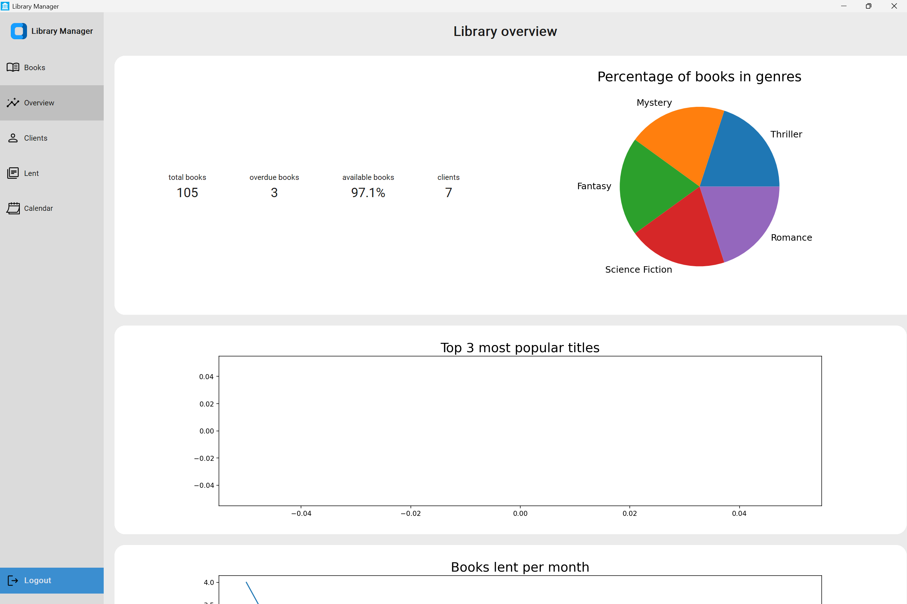
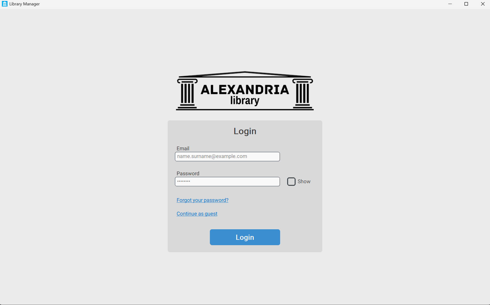
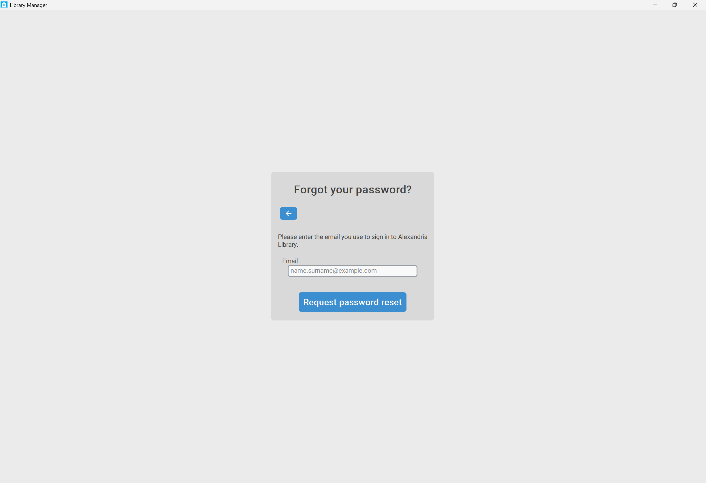
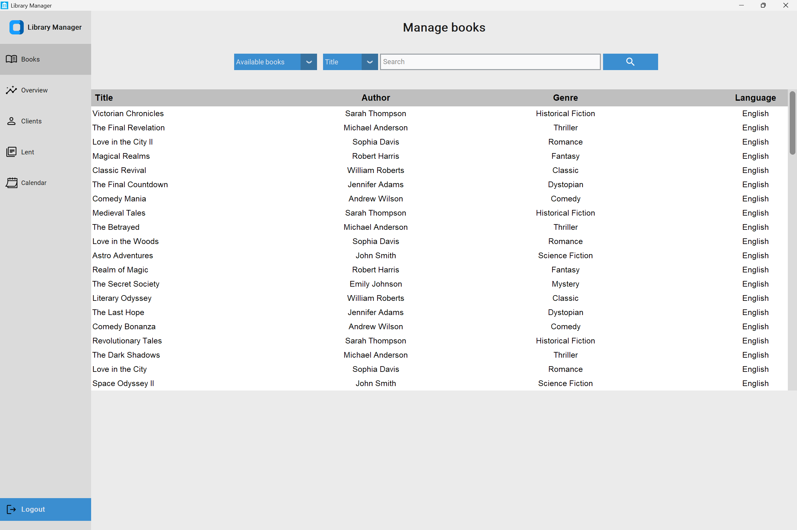
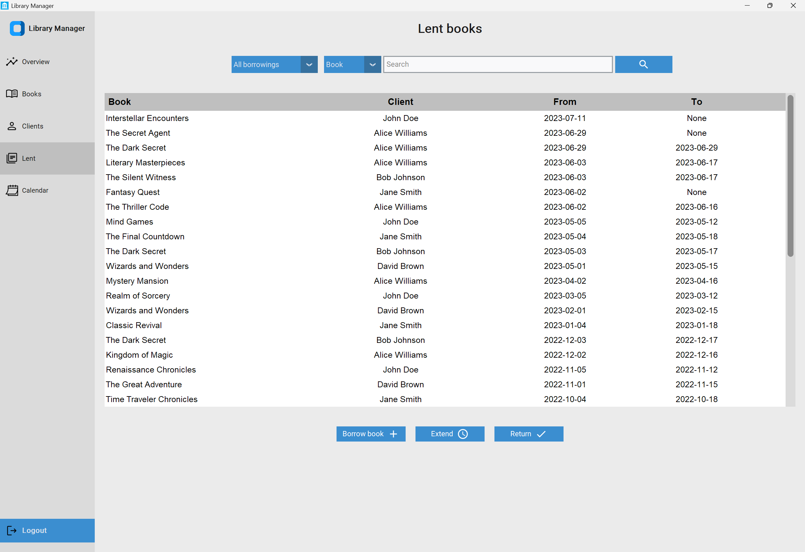

# 📚 Library Administration App

A desktop library management system built with **Python** and **MySQL**. It provides a graphical interface for managing books, borrowers, staff, loans, and reservations in one place.



---

## Table of Contents

- [Features](#features)
- [Screenshots](#screenshots)
- [Tech Stack](#tech-stack)
- [Database](#database)
- [Getting Started](#getting-started)
- [Project Structure](#project-structure)
- [Contributing](#contributing)
- [License](#license)

---

## Features

- **Books** — Manage books, copies, and availability.
- **Borrowers** — Manage borrower information and borrowing history.
- **Staff** — Manage staff accounts and permissions.
- **Loans** — Handle borrowing, returns, renewals, and history.
- **Reservations** — Create and manage book reservations.
- **Authentication** — User login and password recovery.

---

## Screenshots

### Authentication





### Library Management



<!--  -->

### Borrowing



---

## Database

The application uses **MySQL** as its relational database.


---

## Tech Stack

- **Language:** Python 3.10+
- **Database:** MySQL 8.0+
- **GUI:** _add your framework here (e.g. Tkinter, PyQt, CustomTkinter)_
- **Configuration:** environment variables via `.env`

---

## Getting Started

### Prerequisites

- [Python 3.10+](https://www.python.org/downloads/)
- [MySQL 8.0+](https://dev.mysql.com/downloads/)
- [Git](https://git-scm.com/)

### 1. Clone the repository

```bash
git clone <repository-url>
cd The_Library
```

### 2. Install dependencies

Using a virtual environment is recommended:

```bash
python -m venv venv
source venv/bin/activate      # Windows: venv\Scripts\activate
pip install -r requirements.txt
```

### 3. Set up the database

Create the database and import the schema:

```bash
mysql -u your_username -p -e "CREATE DATABASE your_database;"
mysql -u your_username -p your_database < database/schema.sql
```

### 4. Configure environment variables

Create a `.env` file in the project root:

```env
MYSQL_HOST=localhost
MYSQL_USER=your_username
MYSQL_PASSWORD=your_password
MYSQL_DATABASE=your_database
```

> **Note:** Never commit your `.env` file. Make sure it is listed in `.gitignore`.

### 5. Run the application

```bash
python main.py
```

---

## Project Structure

```text
The_Library/
├── main.py              # Application entry point
├── requirements.txt     # Python dependencies
├── .env                 # Local configuration (not committed)
├── database/            # SQL schema and seed data
└── docs/                # Screenshots and database diagram
```

_Adjust this tree to match your actual layout._

---

## Contributing

Contributions are welcome.

1. Fork the repository
2. Create a feature branch: `git checkout -b feature/your-feature`
3. Commit your changes: `git commit -m "Add your feature"`
4. Push to the branch: `git push origin feature/your-feature`
5. Open a pull request

---

## License

Distributed under the **MIT License**. See [`LICENSE`](LICENSE) for details.
